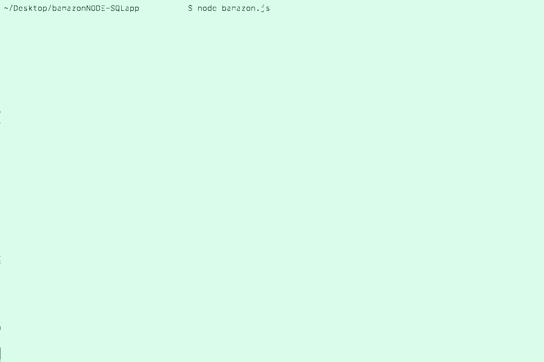

# bamazon App

The bamazon app connects to a database 
App built with Node and SQL which simulates the taking of orders from customers, purchasing of products and the resulting depletion of stock from a store's inventory.

## Getting Started

To get started, below are some instructions for what is needed to get bamazon up and running.

## Requirements

Node must be installed for bamazon to work.

MySQL must also be installed. 

Node Package Managers needed for bamazon: 

After installing NPM, install the listed NPMs:

cli-table
mysql
inquirer

## Database 

bamazon uses mysql database to pull data from a created table.

Once mySQL and mySQL workbench are installed properly, make a database with columns "id", "name" (of the product), "department name", "price", and "quantity in stock".

Afterwards, insert the appropriate values. 

Then, run the table, save the database and continue to the node .js file for the logic.

## Node

#### NPMS
require all NPMs that are needed listed under installation requirements.

## mySQL

In node, create a connection to mySQL through a PORT that runs locally on your machine. Insert your mySQL credentials with the database name.

## Table

Create a new table using "New" to insert column strings as the new table's column heads.

Once connected, retrieve table data from the database with the query: SELECT * FROM (tablename) and iterate through the data and then inserting those vales with "toString".

Doing this will generate your table on the command line.

## Inquirer

Perform another connection query with a callback function passing in paramters to retrieve response from the table.

Choose the "rawlist" type prompt and keep track of its "name".

Before adding the message to prompt users for the item ID that a user can choose from, add a choices function. Within the function, interate through the response to pull the name from each item within the table from the mySQL connection query and push to an empty array. After looping through the response name, return the array within choices, and the user selection will include the "name" from the data table response.

The next prompt type will be "input" and will include the message asking the user for the quantity of items.

Within the .then function after the inquirer prompt, interate through the response that was sent by the database in the previous connection query. Within the loop, create a condition for the interation so that input must be the same as th

