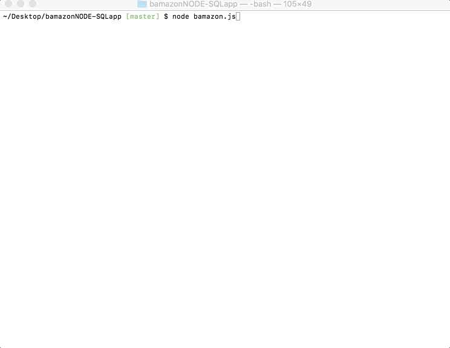

# bamazon App

The bamazon app connects to a database 
App built with Node and SQL which simulates the taking of orders from customers, purchasing of products and the resulting depletion of stock from a store's inventory.

## Getting Started

To get started, below are some instructions for what is needed to get bamazon up and running.

###Prequisites

###Requirements

Node must be installed for bamazon to work.

MySQL must also be installed. 

Node Package Managers needed for bamazon: 

After installing NPM, install the listed NPMs:

cli-table
mysql
inquirer

###Database 

bamazon uses a mysql database and generates the data from a created table.

Use my sql to insert data into 

<<<<<<< HEAD

=======

>>>>>>> f899ded0e175a8e36298111debed520814dbf05f

bamazon is an app that was built using node.js and is run on a Command Line Interface (CLI)

When the bamazon app is started, a table displays listing all of the products for sale in the bamazon shop. The table's columns include the "id", the "Product Name", "Department Name", "Price ($)", and "Quantity in Stock". The rows for each product are numbered by the "id" and include the content details for each column. Resembling popular online shops with a variety of items, bamazon's inventory reflects such trends. 

The user is prompted for input with a message asking "What is the ID of the item you would like to purchase?". The user's input is limited to the numbered list of items by the id in the table and must enter an existing id number from the table.

The next prompt asks the user 

From the user's perspective, bamazon begins with a display of a table that lists all of the items "for sale" available for "purchase". The table lists the 

a prompt asking 

